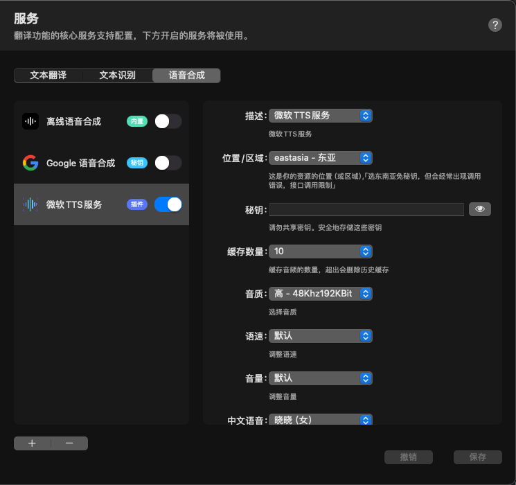

# Microsoft-TTS-Service-BobPlugin
Microsoft-TTS-Service-BobPlugin

该服务需要你满足以下三个条件：(选东南亚，可以不用)

- Azure 订阅 - [免费创建订阅](https://azure.microsoft.com/free/cognitive-services)。
- 在 Azure 门户中[创建语音资源](https://portal.azure.com/#create/Microsoft.CognitiveServicesSpeechServices)。
- 你的语音资源密钥和区域。 部署语音资源后，选择“转到资源”以查看和管理密钥。 有关 Azure AI 服务资源的详细信息，请参阅[获取资源密钥](https://learn.microsoft.com/zh-cn/azure/ai-services/multi-service-resource?pivots=azportal#get-the-keys-for-your-resource)。

⚠️**使用免费(F0)语音资源。神经网络声音的免费配额上限为每月 50 万个字符，每个文件限制为 3000 个字符。**

注册申请，10分钟的事情，自行搜索。

### 插件

插件在原作者0.0.9的基础上修改，原插件在调用TTS语音服务时，经常出现失败的情况。原因可能是东南亚API的网络问题（猜的）

#### 2024-02-04 v1.1.4

- 修改Bob v1.9.0 info.json-menuValues-value数据类型为int导致的错误。

#### 2023-09-26 v1.1.2

- 什么也没做，测试更新能否成功

#### 2023-09-26 v1.1.1

- 做了一些优化
- 增加了 插件发布信息 URL

#### 2023-09-26 v1.1.0

- 新增缓存数量设置（最高100，性能上没做测试，如果慢就选小点）
- 添加了原作者的东南亚接口，东亚、东南亚二选一，选择东亚需要你申请密钥，优点是稳定。
- 优化了代码
- 使用官方了logo
- 缓存文件可到以下目录手动删除
  - 社区版：～/Library/Application Support/com.ripperhe.Bob/VirtualSandbox/Documents/InstalledPluginSandbox/com.microsoft-text-to-speech
  - 商店版：～/Library/Containers/Bob/Data/Documents/InstalledPluginSandbox/com.microsoft-text-to-speech

#### 2023-09-25 v1.0.0

- 改用官方东亚API
- 弃用Java服务端
- 删除台湾方言
- 增加了语速 和 音量选项

#### 2023-09-24 v0.0.10

- 增加Java服务端
- 增加西班牙语
- 增加语音缓存

### ~~服务端~~

#### 2023-09-25（弃用）

~~翻阅TTS官方文档，改用官方SDK，使用JAVA重新封装了服务（speech-service-1.0.0.jar），你可以把它放在服务端 或 本地`安全性暂时没做，建议部署在本地`~~

~~有极小概率会出现超时，猜测可能是sdk的网络问题 或 字节流转字符的问题，有空再看~~

~~本地默认调用：http://127.0.0.1:9527/ms-tts~~
~~并增加了西班牙语。~~
~~增加了语音缓存，减少调用次数，重复听语音速度超快~~

~~缓存会在删除插件时全部删除，目前没有做手动或自动删除，以后再做。~~

感谢原作者：https://github.com/akl7777777/bob-plugin-akl-microsoft-free-tts